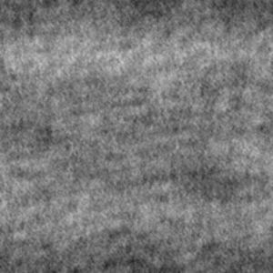
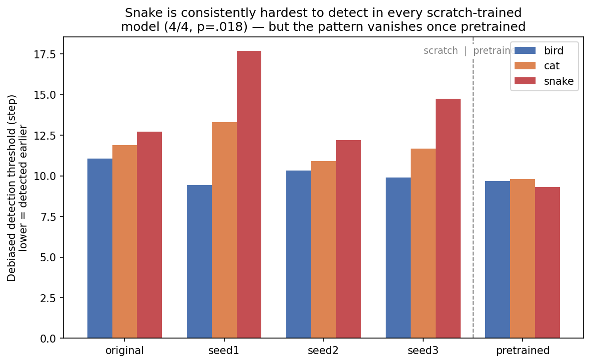

# SDHNet: does a CNN see snakes first?

Humans detect snakes faster than other animals when an image is hard to see. Kawai & He (2016) showed this with progressively unscrambled images. SDHNet asks whether an image classifier trained from scratch shows the same effect.

**Short answer: no.** The first result said yes. It did not survive replication, bias correction, or a pretrained control, and working out why was the useful part.



## What I built

- **Dataset:** 4 classes (bird, cat, fish, snake), 500 images per class (400 train / 100 valid), assembled from a public animals dataset, scraped supplements, and Imagenette. Backgrounds removed with rembg (U2Net).
- **Model:** ResNet18 trained from scratch (no pretrained weights) with fastai / PyTorch, one-cycle schedule, early stopping on validation loss.
- **Degradation experiment:** each test image is revealed step by step (RISE-style). The detection threshold is the step at which the model first gets the class right and stays right.

## Findings

**1. The classifier was cheating on backgrounds.** Cat was the worst class (36% recall in color, 53% in grayscale). Class activation maps and the top losses showed it keying on habitat (a cat on a branch read as a bird). After removing backgrounds, cat recall rose to 87% (color) / 80% (gray). Overall validation accuracy: 82% color, 79% gray.

**2. "Snakes are detected earliest" was response bias.** The first single-model run showed snakes detected early, with a significant test. When I trained three more models on different seeds, the effect fell apart: under heavy degradation every model defaulted to guessing "fish" (an 84–90% prior), and the early detections were mostly that default.

**3. After correcting for the bias, the ordering flipped, and still did not generalize.** With the default subtracted out, snake was detected *latest* of bird, cat and snake in all 4 scratch-trained models. An ImageNet-pretrained ResNet18 (~94.5% validation accuracy) run through the same pipeline showed no separation at all (thresholds 9.3–9.8). So the ordering is an artifact of training on little data, not a property of snakes.

**4. The fish default is the robust finding.** It got *stronger* in the pretrained model (93.1% prior), so it is not a small-data symptom.

Along the way I found two bugs in my own evaluation code: a test-image seed that was not reproducible, and a missing normalization step that fed the model corrupted input. Every number above comes from after those fixes.



## Limitations

- Accuracy figures are **validation accuracy from a single run**, on a set also used for model selection. There is no held-out test set yet. Replication seeds scored 68–80%.
- One architecture (ResNet18).
- No human data. Any comparison to Kawai & He is conceptual, not statistical.
- Background removal may leave class-specific edge artifacts (thin snake bodies segment differently from fish); not yet audited.

## Repository layout

```
notebooks/   interactive work: training, CAM analysis, the RISE experiment
scripts/     pipeline and experiment scripts (runnable from anywhere)
results/     plots and significance-test summaries
```

| File | Purpose |
|---|---|
| `scripts/download_more_images.py`, `scripts/prepare_dataset.py`, `scripts/cleanup_cat.py` | Collect and build the 4-class dataset |
| `scripts/remove_backgrounds.py` | Background removal with rembg |
| `notebooks/sdhnet_4class_color.ipynb`, `notebooks/sdhnet_4class_gray.ipynb` | Training (scratch ResNet18) |
| `notebooks/class_activation_map*.ipynb` | CAM analysis of the background shortcut |
| `scripts/rise.py`, `notebooks/rise_experiment.ipynb`, `scripts/run_rise_on_model.py`, `scripts/run_rise_full_probs.py` | Degradation experiment and threshold extraction |
| `scripts/train_seed.py`, `scripts/run_baseline_seeds.py` | Seed replication (trained and untrained baselines) |
| `scripts/train_pretrained.py` | ImageNet-pretrained control |
| `scripts/compare_decision_rules.py`, `scripts/analyze_results.py` | Response-bias correction and significance tests |
| `scripts/make_blog_visuals.py` | Figures in this README |

Data (`data/`) and model weights (`models/`) are not committed (about 3.5 GB). `scripts/prepare_dataset.py` rebuilds the dataset. Scripts resolve paths from the repo root, and notebooks do the same in their first cell.

## Setup

```bash
python -m venv .venv && source .venv/bin/activate
pip install -r requirements.txt
```

## Reference

Kawai, N., & He, H. (2016). Breaking snake camouflage: Humans detect snakes more accurately than other animals under less discernible visual conditions. *PLOS ONE*, 11(10), e0164342.
